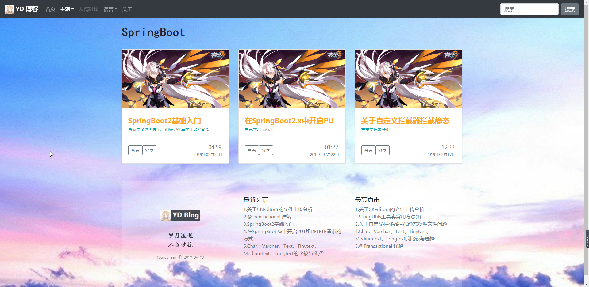
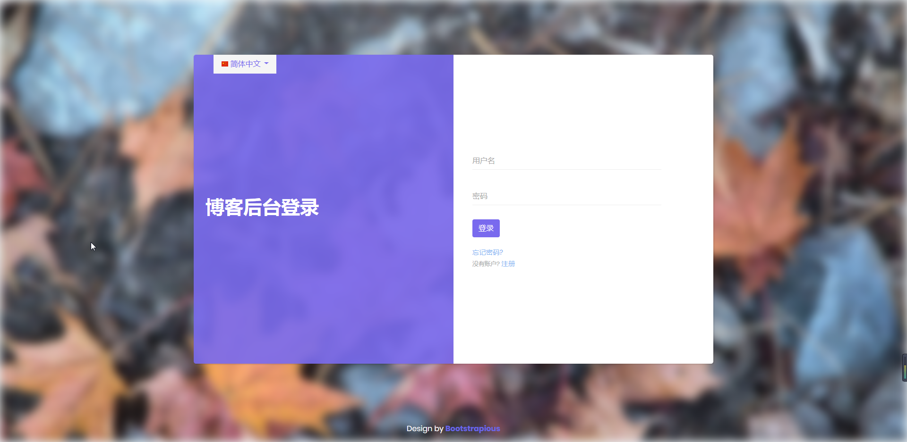
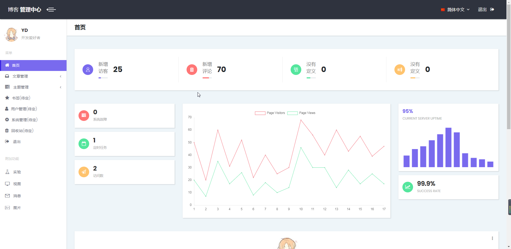
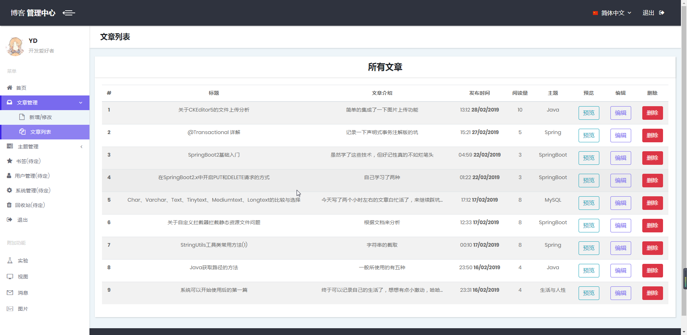
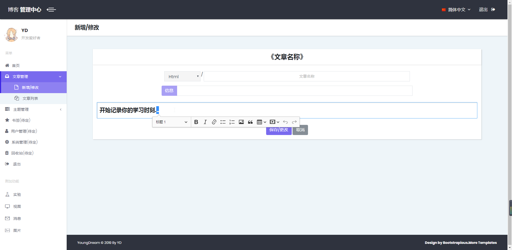
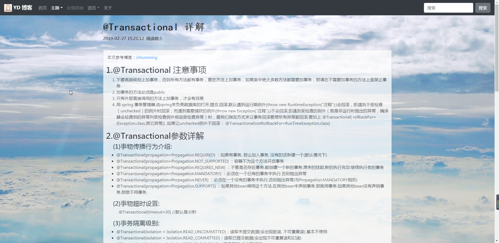

## YD Blog
想记录一下自己的学习情况和生活点滴，所以写下了这个博客系统，最后总算是能用了。但是前期没有规划好，后期想加功能时发现无从下手，后面还会搭一个有点经验的分布式博客系统，一方面是总结Boot，一方面是学习Cloud，踩坑中...

### 效果图
1. 主页

2. 后台登录页面

3. 后台首页

4. 文章管理页面

5. 添加或修改页面

6. 文章页面

**个人评价：**
- 本人前端技术和审美都有问题，才会写出这么个丑的前台页面
- 后台页面是用的大神前端代码，所以看起来好一些

*类和配置文件有些注释，本项目主要是爬坑，所以...哈哈...能看懂就看吧*